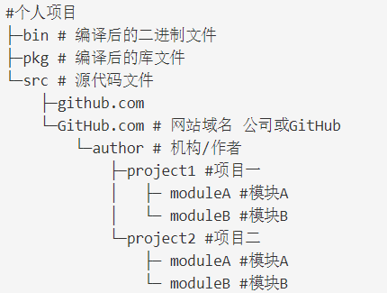

### Go语言

---

#### **项目目录结构**

  
#### **学习资源**   
1. Go入门
   - [学习视频](https://www.bilibili.com/video/BV1h7411x7JB?p=14)        
  
2. GO进阶+实战
   - [学习视频](https://www.bilibili.com/video/bv1FV411r7m8/?spm_id_from=333.788.b_636f6d6d656e74.26)      
   
   