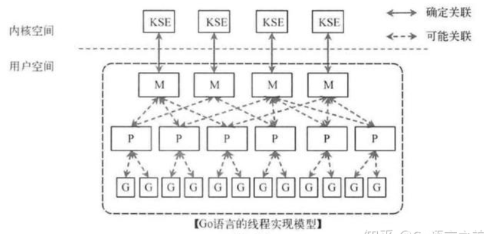
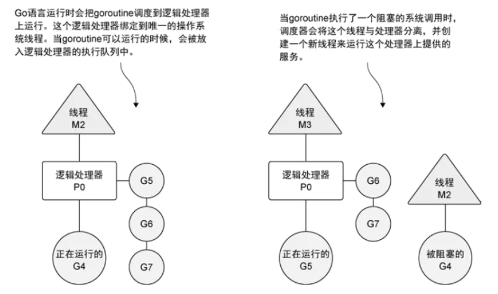

## 并发编程之` goroutine` 


` goroutine` 是Go语言中的轻量级线程实现，由Go运行时（runtime）管理。你将会发现，它的 使用出人意料得简单。 

- 并发的口号：不要通过共享内存来通信，而应该通过通信来共享内存。

### 快速入门

- 主线程是一个物理线程，直接作用在CPU上的，是重量级的所以非常耗费CPU资源
- 协程是从主线程开启的，是轻量级的线程，是逻辑态，对资源消耗相对较小
- `Golang`的协程机制 重要的特点是 可以轻松的开启上万个协程，而其他编程语言的并发机制一般是基于线程的，开启过多的线程，资源耗费大，这就突显了` Golang` 在并发上的优势。

#### 1. 并发问题

假设我们需要实现一个函数Add()，它把两个参数相加，并将结果打印到屏幕上，具体代码 如下：

```go
func Add(x, y int) {
	z := x + y
	fmt.Println(z)
}
```

那么，如何让这个函数并发执行呢?具体代码如下：

```go
// 加入 go 关键字，开启协程
go Add(1, 1) 
```

是不是很简单?  

你应该已经猜到，“go”这个单词是关键。与普通的函数调用相比，这也是唯一的区别。

在一个函数调用前加上go关键字，这次调用就会在一个新的` goroutine` 中并发执行。当被调用 的函数返回时，这个` goroutine` 也自动结束了。

需要注意的是，**如果这个函数有返回值，那么这个 返回值会被丢弃**。

好了，现在让我们动手试一下吧，还是刚才Add()函数：

```go
package main

import (
	"fmt"
)

func main() {
	for i := 1; i <= 10; i++ {
		go Add(i, i)
	}
}

func Add(x, y int) {
	z := x + y
	fmt.Println(z)
}
```

在上面的代码里，我们在一个for循环中调用了10次Add()函数，它们是并发执行的。可是 当你编译执行了上面的代码，就会发现一些奇怪的现象:

- “什么？！屏幕上什么都没有，程序没有正常工作！

- ” 是什么原因呢？明明调用了10次Add()，应该有10次屏幕输出才对。要解释这个现象，就涉 及Go语言的程序执行机制了。

**Go语言执行机制：** 

Go程序从初始化main package并执行main()函数开始，当main()函数返回时，程序退出， 且程序并不等待其他 ` goroutine` （非主` goroutine` ）结束。

对于上面的例子，主函数启动了10个 ` goroutine` ，然后返回，这时程序就退出了，而被启动的 执行Add(i, i)的 ` goroutine` 没有来得及执行，所以程序没有任何输出。 

OK，问题找到了，怎么解决呢？

提到这一点，估计写过多线程程序的读者就已经恍然大悟， 并且摩拳擦掌地准备使用：

- 类似 ` WaitForSingleObject` 之类的调用
- 或者写个自己很拿手的忙等待
- 或者 稍微先进一些的 ` sleep` 循环 **等待来等待所有线程执行完毕**。

在Go语言中有自己推荐的方式，它要比这些方法都优雅得多。 要让主函数等待所有 ` goroutine` 退出后再返回，如何知道 ` goroutine` 都退出了呢? 

这就引出了多个  ` goroutine` 之间通信的问题。下面 我们将主要解决这个问题。

#### 2. 并发通信

从上面的例子中可以看到，关键字go的引入使得在Go语言中并发编程变得简单而优雅，但 我们同时也应该意识到并发编程的原生复杂性，并时刻对并发中容易出现的问题保持警惕。别忘 了，我们的例子还不能正常工作呢。 

事实上，不管是什么平台，什么编程语言，不管在哪，并发都是一个大话题。话题大小通常 也直接对应于问题的大小。并发编程的难度在于协调，而协调就要通过交流。从这个角度看来，并发单元间的通信是最大的问题。

在工程上，有两种最常见的并发通信模型：**共享数据** 和 **消息。**

- **共享数据** 是指多个并发单元分别保持对同一个数据的引用，实现对该数据的共享。被共享的 数据可能有多种形式，比如内存数据块、磁盘文件、网络数据等。在实际工程应用中最常见的无疑是内存了，也就是常说的**共享内存**。 
- **消息机制** 认为每个并发单元是自包含的、独立的个体，并且都有自己的变量，但在不同并发 单元间这些变量不共享。每个并发单元的输入和输出只有一种，那就是消息。这有点类似于进程 的概念，每个进程不会被其他进程打扰，它只做好自己的工作就可以了。不同进程间靠消息来通 信，它们不会共享内存。Go语言提供的消息通信机制被称为channel。


### 调度模型-MPG

#### 1. 传统的并发模式

多线程共享内存，这也是Java、C#或者C++等语言中的多线程开发的常规方法，其实golang语言也支持这种传统模式。

另外一种是Go语言特有的，也是Go语言推荐的：**CSP**（communicating sequential processes）并发模型。

不同于传统的多线程通过共享内存来通信，CSP讲究的是“以通信的方式来共享内存”。 “不要以共享内存的方式来通信，相反，要通过通信来共享内存。”

#### 2. 使用MPG模式实现CSP

在传统的并发中起很多线程只会加大CPU和内存的开销，太多的线程会大量的消耗计算机硬件资源，造成并发量的瓶颈。

- M指的是Machine，一个M直接关联了一个内核线程，是操作系统的主线程（是物理线程）。
- P指的是”processor”，代表了M所需的上下文环境，也是处理用户级代码逻辑的处理器。
- G指的是Goroutine，协程，其实本质上也是一种轻量级的线程。

 

理解：

- M关联了一个内核线程，通过调度器P（上下文）的调度，可以连接1个或者多个G,相当于把一个内核线程切分成了了N个用户线程；
- M和P是一对一关系（但是实际调度中关系多变），通过P调度N个G（P和G是一对多关系），实现内核线程和G的多对多关系（M:N），通过这个方式，一个内核线程就可以起N个Goroutine，同样硬件配置的机器可用的用户线程就成几何级增长，并发性大幅提高。

##### 2.1 MPG运行的状态1

可以看到操作系统线程、逻辑处理器和本地运行队列之间的关系。如果创建一个`  goroutine `并准备运行，这个 `  goroutine ` 就会被放到**调度器的全局运行队列**中。之后，调度器就将这些队列中的 `  goroutine ` 分配给一个逻辑处理器，并放到这个逻辑处理器对应的**本地运行队列**中，本地运行队列中的 `  goroutine ` 会一直等待直到自己被分配的逻辑处理器执行。

  

### 设置CPU运行数

为了充分利用多CPU的优势，在` Golang`程序中,设置运行的CPU数目

```go
package main

import (
	"fmt"
	"runtime"
)

func main() {
	cpuNum := runtime.NumCPU()
	fmt.Println("cpuNum = ", cpuNum)

	// 可以设置使用多个CPU
	gomaxprocs := runtime.GOMAXPROCS(cpuNum - 1)
	fmt.Println("gomaxprocs = ",gomaxprocs)
}
```

- go 1.8 以后，默认让程序运行在多个核上，可以不用设置
- go 1.8 以前，还要设置一下，可以更高效的利用CPU

